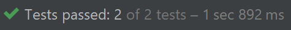

# HibernateCarPassJDBC

Напишите программу для учёта событий проезда автомобилей через шлакбаум. 
Для этого создайте таблицу в БД с колонками: id, номер автомобиля, дата проезда. 
Используйте паттерн Dao для взаимодействия с БД. 
Dao должно содержать один метод для записи события проезда автомобиля. 
Необходимо использовать gradle и hibernate

Тесты прошли проверку:
 

PostgreSQL:

``` roomsql
CREATE TABLE IF NOT EXISTS CAR(
ID SERIAL PRIMARY KEY,
REGISTRATION_NUMBER VARCHAR NOT NULL,
PASS_DATE DATE NOT NULL
);

SELECT * FROM CAR;
```
